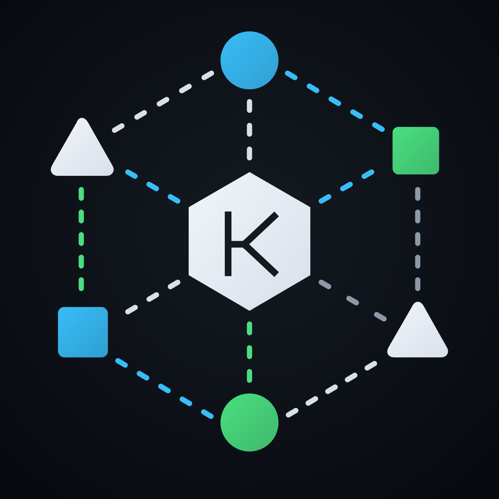

<p align="center">
  
</p>

<h1 align="center">Kranz</h1>

<p align="center">
  <strong>A keyboard-first local service orchestrator with a focused terminal UI.</strong>
</p>

<p align="center">
  <a href="https://github.com/kranz-org/kranz/actions/workflows/ci.yml"></a>
  <a href="https://github.com/kranz-org/kranz/releases"></a>
  <a href="LICENSE"></a>
</p>

Kranz (German for “wreath”) keeps a project’s local services, logs, health checks, and listening ports in one place. Its numbered panel navigation follows the same working model as lazygit: services and details on the left, with the focused service’s output on the right.

## Features

- Centralized start, stop, restart, and shutdown
- Five dependency conditions: started, healthy, completed, successful completion, and log-ready
- Automatic recovery policies with backoff and restart limits
- Ordered shutdown with custom commands, signals, timeouts, and process/parent targeting
- Tag-based selection and grouped startup
- Port conflict detection with Kranz/external ownership, PID, and process details
- HTTP, TCP, and command health checks
- Color-coded logs, optional capture timestamps, regex filter/highlight, wrapping, pause/follow mode, and unread counters
- 19 contrast-oriented themes with independent theme, accent, and terminal-adaptive background sources
- Complete mouse control for panels, selections, action bars, search, and modals
- `Ctrl+O` command-shell handoff without stopping managed services
- Safe compatibility mode for common `process-compose.yaml` projects
- Automatic configuration hot reload with last-known-good fallback
- Multiple merged configuration files plus `.env` and per-service `env_file` support
- In-app notifications and operation status
- Process-group cleanup on `q`, `Ctrl+C`, `SIGTERM`, `SIGHUP`, and TUI errors

## Install

### Homebrew

```bash
brew install kranz-org/tap/kranz
```

Homebrew builds Kranz from the versioned release tag and verifies its source
checksum. The tap is updated automatically for every stable GitHub release.

### GitHub release

Download the archive for your operating system and architecture from
[GitHub Releases](https://github.com/kranz-org/kranz/releases), verify it against
`checksums.txt`, and place `kranz` on your `PATH`.

### Build from source

```bash
git clone https://github.com/kranz-org/kranz.git
cd kranz
make build
./bin/kranz
```

### Install with Go

Install the latest public release directly:

```bash
go install github.com/kranz-org/kranz/cmd/kranz@latest
kranz --version
```

For a local checkout, `make install` installs the current source revision into
`GOBIN` or `GOPATH/bin`:

```bash
make install
kranz
```

## Configure

Create `kranz.yaml` in the project directory:

```yaml
project: MyProject
version: "1.0"

ui:
  theme: tokyo-night
  accent: "#7AA2F7"
  background: terminal
  color_mode: auto

defaults:
  dir: .
  shell: /bin/bash
  env_files: [.env.shared]

services:
  server:
    command: bun run --watch src/main.ts
    ports: [3801, 3802]
    tags: [backend, core]
    healthcheck:
      readiness:
        type: http
        url: http://localhost:3801/ready
        interval: 5s
      liveness:
        type: http
        url: http://localhost:3801/live
        interval: 10s

  web:
    command: npm run dev
    dir: apps/web
    ports: [3000]
    tags: [frontend]
    depends_on: [server]
    dependency_conditions:
      server:
        condition: process_healthy
    availability:
      restart: on_failure
      backoff: 2s
      max_restarts: 5
    shutdown:
      signal: 15
      timeout: 10s
```

Run Kranz from that directory, or pass a config path explicitly:

```bash
kranz
kranz path/to/kranz.yaml
kranz -f kranz.yaml -f kranz.local.yaml
```

Without an explicit path, Kranz looks for `kranz.yaml`, `kranz.yml`,
`process-compose.yaml`, and `process-compose.yml`, in that order.
For Process Compose projects, a matching `process-compose.override.yaml` or
`process-compose.override.yml` is merged automatically when present. Explicit
files are merged from left to right.

Kranz reads `.env` beside the first configuration file for variable expansion
and process environment defaults. `defaults.env_files`, service `env_files`,
and Process Compose `env_file`/`is_dotenv_disabled` entries are also supported. Direct service
environment values have the highest precedence. Configuration and environment
files are watched; valid edits are reconciled automatically, while invalid edits
leave the last known good runtime untouched. Press `Ctrl+L` to reload immediately.

### Process Compose compatibility

Kranz can load a useful, intentionally safe subset of Process Compose configuration:

- Process command, description, working directory, namespace (as a tag), environment, `env_file`, and `disabled`/`is_disabled` state
- `process_started`, `process_healthy`, `process_completed`, `process_completed_successfully`, and `process_log_ready` dependencies
- HTTP and exec readiness/liveness probes, including timing, headers, status code, and inferred HTTP ports
- `ready_log_line`, additional successful exit codes, restart/backoff/exit policies, and custom shutdown behavior
- Project-level name, version, and environment
- Multiple `-f` files, conventional override discovery, and live `Ctrl+L` reload

Unsupported execution models are rejected instead of being silently misinterpreted: replicas above one, schedules, and daemon/TTY/interactive/foreground modes. Remote/headless control, scaling, scheduled jobs, elevated/interactive execution, and persistent file-log infrastructure remain intentionally outside this compatibility layer. Disabled processes stay visible and can be started manually. Configured Process Compose file logging is reported as ignored in the notification center.

### Themes and user settings

Built-in themes: `kranz`, `tokyo-night`, `dracula`, `nord`, `gruvbox-dark`, `catppuccin-mocha`, `rose-pine`, `solarized-dark`, `monokai`, `everforest`, `one-dark`, `github-dark`, `ocean`, `forest`, `amber`, `high-contrast`, `github-light`, `solarized-light`, and `cream`.

Every built-in theme has a light and dark variant. `ui.color_mode` selects `auto` (the default), `dark`, or `light`. Auto detects the terminal background at startup, follows macOS and supported Linux system appearance changes, and checks independent terminal-profile changes whenever the terminal regains focus. `Ctrl+L` is only a manual fallback.

Background ownership is independent from color mode. Set `ui.background` to `terminal` (the default) to leave the canvas unpainted so the terminal profile supplies its exact background. Use `theme` to paint the selected theme's current light or dark surface. For example, `theme: cream`, `background: theme`, and `color_mode: auto` paints warm cream in a light terminal and the theme's dark warm-brown variant in a dark terminal. Canvas and panel surfaces always share one base instead of producing a gray-outside/white-inside split.

Open the live theme picker with `Ctrl+T`. Arrow navigation previews a selected theme. `p` toggles between the project and selected theme, `a` toggles between the project and theme-default accent, `b` toggles terminal/theme background ownership, and `m` cycles Auto/Dark/Light. The four choices are independent, and the summary always shows exactly what will be saved.

Press `Enter` to save globally as a personal user override. User settings are written atomically with user-only permissions to the platform configuration directory: `~/Library/Application Support/kranz/settings.yaml` on macOS and typically `~/.config/kranz/settings.yaml` on Linux. Press `c` to save the same appearance to the project's native Kranz YAML instead, making it the project default and clearing the matching global overrides. The picker shows both destination paths. With multiple `-f` layers, Kranz updates the last native configuration layer because it has the highest precedence. Process Compose files are never rewritten; use a native Kranz configuration layer when project theme persistence is required. `Esc` closes the picker without saving.

## Controls

Visible controls are clickable in terminals with mouse support: panel titles, service/tag rows and checkboxes, the bottom action bar, search controls, modal actions, and the complete theme picker. The mouse wheel scrolls focused content and modal lists. Keyboard shortcuts remain the fastest path.

| Key | Action |
|---|---|
| `1`, `2`, `3` | Focus Services/Tags, Details, or Logs; when the list is focused, `1` switches Services/Tags |
| `Shift+3` | Pin/unpin the focused service logs above the active log panel |
| `↑` / `↓`, `j` / `k` | Move or scroll inside the focused panel |
| `Space` | Add/remove the focused service or tag from the selection |
| `s` | Start stopped targets, or stop them when all targets are active |
| `Shift+S` | Start only the selected/focused targets without checking or starting dependencies |
| `r` | Restart the selected service |
| `a` | Select all services, or clear the full selection |
| `A` | Stop all services |
| `R` | Restart services that are currently running |
| `t` | Switch the first panel between Services and Tags |
| `T` | Clear the tag selection |
| `h` | Show health-check history |
| `n` | Open notifications |
| `/` | Regex-filter focused logs; use `Tab` in the editor for highlight mode |
| `n` / `N` | Jump to the next/previous match in highlight mode |
| `w` | Toggle wrapping for long log lines |
| `i` | Show or hide the time each log line was captured |
| `f` | Pause or resume log following |
| `c` | Clear selected service logs |
| `q` | Quit, stopping all managed processes first |
| `Ctrl+C` | Immediately stop all managed processes and quit |
| `Ctrl+T` | Preview themes and save them to user settings or the project config |
| `p` / `a` / `b` / `m` in Themes | Toggle theme, accent, background ownership, or Auto/Dark/Light mode |
| `Enter` / `c` in Themes | Save globally / save to the project config |
| `Ctrl+L` | Reload configuration and detect the terminal appearance immediately |
| `Ctrl+O` | Open a command shell; press `Ctrl+O` again to return to Kranz |
| `?` | Open help |

When no services or tags are checked, `s` targets the focused row. Selected tags expand to all matching services, so a group such as `frontend` can be started or stopped as one target. Starting includes required dependencies. A service waiting for its dependency gate is shown with a yellow dot and an explicit `queued` label; Details names the dependencies it is waiting for. Once all targets are active or queued, the next `s` cancels/stops them—even while readiness is still pending. Enter does not control service lifecycle.

`Shift+S` is an explicit dependency override: it starts exactly the selected services, or the focused service when nothing is selected. It does not start dependency services and does not wait for dependency conditions. Port-conflict and process-ownership safety checks remain enabled.

For a full batch, press `a`, then `s`: stopped services are started, while an entirely active selection is stopped. Press `a` again to clear the selection. Uppercase `A` remains the immediate stop-all shortcut.

When a configured port is busy, Kranz distinguishes a listener owned by another managed service from an external process. An external conflict offers `k` to stop that exact PID and retry. Before sending a signal, Kranz scans the port again and refuses the action if the PID changed or became Kranz-owned. It tries `SIGTERM` first and only escalates after a grace period.

The Details panel below the compact service list shows readiness and liveness separately, with each check target on its own line, plus ports, tags, typed dependencies, recovery state, shutdown behavior, environment files, working directory, command, and PID. Active listeners include the detected protocol and bind address (for example, `tcp://127.0.0.1:3801`) when the operating system exposes them. Focus panel `2` and use arrows to scroll when its content exceeds the available height.

Log search compiles the entered text as a regular expression and applies it only to the focused service’s bounded in-memory log buffer. Filter mode is the default and hides non-matching rows while continuing to follow new matching output. Press `Tab` in the regex editor to select Highlight mode, which keeps every row visible and supports `n`/`N` navigation. Optional timestamps are capture metadata and never become part of the searchable text. Child-process terminal control sequences are stripped before rendering so a service cannot clear or reposition the Kranz interface. It does not search log files on disk.

`readiness` and `liveness` are independent optional blocks. Every configured block must declare its own `type` (`http`, `tcp`, or `command`); an empty `healthcheck` block is rejected.

## Development

Requirements: Go 1.24 or newer, macOS or Linux.

```bash
make build    # Build for the current platform
make test     # Run tests with the race detector and coverage
make verify   # Format-check, vet, test, and build
make lint     # Run golangci-lint
make run      # Build and run
make install  # Install into GOPATH/bin
make snapshot # Build local Darwin/Linux release archives
make clean    # Remove build output
```

Kranz uses Semantic Versioning, annotated `vMAJOR.MINOR.PATCH` tags, and
automated GitHub releases. See [CONTRIBUTING.md](CONTRIBUTING.md) for the normal
contribution flow and [docs/RELEASING.md](docs/RELEASING.md) for the one-time
public-repository setup and maintainer release checklist.

Project layout:

```text
cmd/kranz/       CLI entry point and signal lifecycle
internal/config/ Configuration loading and validation
internal/service Process and service lifecycle ownership
internal/health/ Readiness and liveness checks
internal/port/   Port inspection on macOS and Linux
internal/log/    Log parsing and search
internal/ui/     Bubble Tea terminal UI
pkg/ringbuffer/  Concurrent bounded log storage
```

## License

MIT — see [LICENSE](LICENSE).
