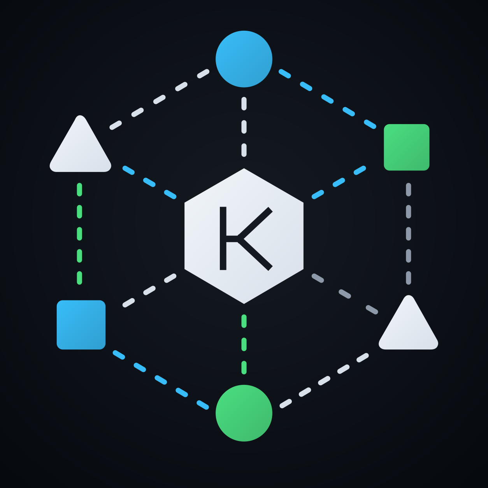
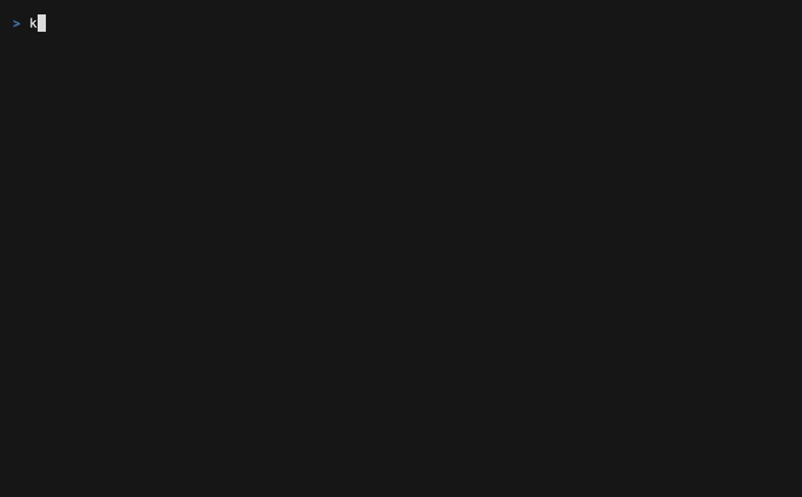

<p align="center">
  
</p>

<h1 align="center">Kranz</h1>

<p align="center">
  <strong>A keyboard-first local service orchestrator with a focused terminal UI.</strong>
</p>

<p align="center">
  <a href="https://github.com/kranz-org/kranz/actions/workflows/ci.yml"></a>
  <a href="https://github.com/kranz-org/kranz/releases"></a>
  <a href="LICENSE"></a>
</p>

Kranz runs and monitors long-running development services directly on the host.
It keeps their state, dependencies, health checks, ports, and logs in one
keyboard-first terminal interface, with numbered panel navigation in the style
of lazygit.

It is designed for projects with several local processes that have outgrown
separate terminal tabs. It can be used alongside Docker Compose: keep
infrastructure such as PostgreSQL, Redis, or ClickHouse in containers while
running the applications you are actively developing through Kranz.

Available for macOS and Linux on x86-64 and ARM64.

<p align="center">
  
</p>

## Where Kranz fits

Use Kranz when you want to:

- Start services in dependency order and wait for readiness
- Inspect service state, health checks, ports, and logs in one place
- Restart or stop individual services without losing the rest of the stack
- Keep infrastructure containerized while running application code natively

Kranz is not a container runtime or a deployment orchestrator. If a shell
script, Justfile, or a few terminal tabs already cover your workflow, you
probably do not need it.

## Quick start

Install Kranz with Homebrew:

```bash
brew install kranz-org/tap/kranz
```

Or with Go 1.24 or newer:

```bash
go install github.com/kranz-org/kranz/cmd/kranz@latest
```

Prebuilt archives and build-from-source instructions are under
[Install](#install).

Create a `Procfile`. This example uses Python 3 as a stand-in web service and
needs no Kranz-specific configuration:

```procfile
web: python3 -u -m http.server 8000 --bind 127.0.0.1
worker: while true; do date; sleep 2; done
```

Run `kranz`, then press `a` followed by `s` to start both services. Open the
`web` Details panel to see its actual listening port. Kranz discovers the port
at runtime even though Procfile has no port syntax.

Already using Process Compose? Run `kranz` in a directory containing a
supported `process-compose.yaml`; no separate Kranz configuration is required.

Use native `kranz.yaml` when you want dependencies, health checks, recovery,
tags, or explicit lifecycle controls. Runnable Procfile, native YAML, Process
Compose, and port-discovery projects live in [`examples/`](examples/).

## Features

- **Dependency-aware startup** with five conditions: started, healthy,
  completed, completed successfully, and log-ready
- **Health checks** over HTTP, TCP, or a command, with separate readiness and
  liveness probes
- **Recovery policies** with backoff and restart limits
- **Ordered shutdown** in reverse dependency order, with per-service commands,
  signals, and timeouts
- **Port conflict detection** that distinguishes a Kranz-owned listener from an
  external process, with PID and process details
- **Runtime port discovery** for TCP listeners opened by a service or any child
  in its process group, even when no ports are configured
- **Log inspection**: color-coded output, regex filter and highlight, wrapping,
  pause/follow, and unread counters
- **Tag-based selection** for starting or stopping a group as one target
- **Process-group cleanup**: each service runs in its own process group and is
  signalled as a group on `q`, `Ctrl+C`, `SIGTERM`, `SIGHUP`, and TUI errors,
  escalating to `SIGKILL` after the timeout
- **Configuration hot reload** with last-known-good fallback, across multiple
  merged files, `.env`, and per-service `env_file`
- **Process Compose compatibility** for a safe subset of existing
  `process-compose.yaml` projects
- **Procfile compatibility** for conservative `name: command` files, preserving
  service order and command text
- **Live appearance editing** for theme, accent, canvas, and color mode, with
  temporary apply, personal/project saves, and reload of the saved appearance

Interface details — 19 themes, full mouse support, `Ctrl+O` shell handoff, and
in-app notifications — are described under [Controls](#controls).

## How it relates to other tools

- **Docker Compose** runs services in reproducible container environments.
  Kranz manages ordinary processes on the host. They can be used together.
- **Just and Make** work well for defining repeatable project commands and their
  dependencies. Kranz is aimed at supervising long-running processes and keeping
  their live state, health, ports, and logs visible.
- **mprocs and similar TUI process runners** focus on running multiple commands
  and organizing their output. Kranz emphasizes service lifecycle: dependency
  conditions, health checks, recovery, ordered shutdown, and port ownership.
- **Process Compose** is the closest alternative and a broader orchestration
  platform, with server/client operation, an API, scaling, schedules, and
  interactive processes. Choose Kranz when you want a foreground, session-scoped
  tool where one terminal owns the local stack and gives you a focused view of
  each service's state, health, ports, and logs. Choose Process Compose when you
  need headless control, an API, scaling, schedules, or interactive processes.
  Kranz can load a safe subset of existing `process-compose.yaml` configurations,
  so supported projects can try it without maintaining a second configuration.

## Install

Kranz supports macOS and Linux on both x86-64 and ARM64. There is no Windows
build; port inspection and process-group handling rely on Unix APIs.

### Homebrew

```bash
brew install kranz-org/tap/kranz
```

Homebrew downloads the prebuilt archive for the current operating system and
architecture and verifies its checksum. The tap is updated automatically for
every stable GitHub release.

### GitHub release

Download the archive for your operating system and architecture from
[GitHub Releases](https://github.com/kranz-org/kranz/releases), verify it against
`checksums.txt`, and place `kranz` on your `PATH`.

### Build from source

```bash
git clone https://github.com/kranz-org/kranz.git
cd kranz
make build
./bin/kranz
```

### Install with Go

Install the latest public release directly:

```bash
go install github.com/kranz-org/kranz/cmd/kranz@latest
kranz --version
```

For a local checkout, `make install` installs the current source revision into
`GOBIN` or `GOPATH/bin`:

```bash
make install
kranz
```

## Configure

### Procfile projects

If your project already has a `Procfile` or `Procfile.dev`, run `kranz` from the
same directory. Each non-comment line becomes a service in file order:

```procfile
web: go run ./cmd/web
worker: bundle exec sidekiq
```

Kranz splits each entry at the first `:`, so colons inside the command are kept.
Service names may contain letters, digits, `_`, and `-`. Blank lines and lines
whose first non-space character is `#` are ignored. Invalid lines, empty
commands, and duplicate names stop the whole load with the file path and line
number; Kranz does not start a partial configuration.

Commands run in the directory containing the Procfile. An adjacent `.env` is
loaded automatically, while an existing host environment value wins over the
same `.env` key. Both files are watched and valid edits hot-reload. Kranz never
rewrites a Procfile, including when project appearance is saved. On stop, Kranz
sends `SIGTERM` to the service process group, allows 30 seconds for graceful
shutdown, and then uses `SIGKILL` if processes remain.

Procfile services do not need a `ports` declaration. After a service starts,
Kranz discovers TCP listeners opened by its command or child processes and
shows them as detected ports in Details.

Select services with `a`, start them with `s`, and quit with `q`.

### Native Kranz YAML

Create `kranz.yaml` in the project directory:

```yaml
project: MyProject
version: "1.0"

ui:
  theme: tokyo-night
  accent: "#7AA2F7"
  background: terminal
  color_mode: auto

defaults:
  dir: .
  shell: /bin/bash
  env_files: [.env.shared]

services:
  server:
    command: bun run --watch src/main.ts
    ports: [3801, 3802]
    tags: [backend, core]
    healthcheck:
      readiness:
        type: http
        url: http://localhost:3801/ready
        interval: 5s
      liveness:
        type: http
        url: http://localhost:3801/live
        interval: 10s

  web:
    command: npm run dev
    dir: apps/web
    ports: [3000]
    tags: [frontend]
    depends_on: [server]
    dependency_conditions:
      server:
        condition: process_healthy
    availability:
      restart: on_failure
      backoff: 2s
      max_restarts: 5
    shutdown:
      signal: 15
      timeout: 10s
```

Run Kranz from that directory, or pass a config path explicitly:

```bash
kranz
kranz path/to/kranz.yaml
kranz -f kranz.yaml -f kranz.local.yaml
```

Without an explicit path, Kranz uses the first existing file in this order:
`kranz.yaml`, `kranz.yml`, `process-compose.yaml`, `process-compose.yml`,
`Procfile.dev`, then `Procfile`. Auto-discovery selects one primary file; in
particular, it does not merge `Procfile.dev` with `Procfile`.
For Process Compose projects, a matching `process-compose.override.yaml` or
`process-compose.override.yml` is merged automatically when present. Explicit
files, including Procfile and native YAML layers, are merged from left to right.

Configuration and environment files are watched. Valid edits are reconciled
automatically, while invalid edits leave the last known good runtime untouched.
Press `Ctrl+L` to reload immediately.

### Environment variables

Kranz reads `.env` beside the first configuration file for variable expansion
and process environment defaults. `defaults.env_files`, service `env_files`, and
Process Compose `env_file`/`is_dotenv_disabled` entries are also supported.
An existing host process-environment value takes precedence over the same key in
the adjacent `.env`; explicit configuration environment values remain explicit
overrides.

Sources are merged per service, from lowest to highest precedence:

1. `.env` beside the first configuration file
2. `defaults.env`
3. `defaults.env_files`, in the listed order
4. Service `env_files`, in the listed order
5. Service `env`

Host environment references such as `$HOME` are expanded after all layers are
merged.

### Health checks

`readiness` and `liveness` are independent optional blocks. Every configured
block must declare its own `type` (`http`, `tcp`, or `command`); an empty
`healthcheck` block is rejected.

### Process Compose compatibility

Kranz can load a useful, intentionally safe subset of Process Compose configuration:

- Process command, description, working directory, namespace (as a tag), environment, `env_file`, and `disabled`/`is_disabled` state
- `process_started`, `process_healthy`, `process_completed`, `process_completed_successfully`, and `process_log_ready` dependencies
- HTTP and exec readiness/liveness probes, including timing, headers, status code, and inferred HTTP ports
- `ready_log_line`, additional successful exit codes, restart/backoff/exit policies, and custom shutdown behavior
- Project-level name, version, and environment
- Multiple `-f` files, conventional override discovery, and live `Ctrl+L` reload

Unsupported execution models are rejected rather than silently misinterpreted:

- Replicas above one
- Schedules
- Daemon, TTY, interactive, and foreground modes

Remote and headless control, scaling, scheduled jobs, elevated execution, and
persistent file-log infrastructure are intentionally outside this compatibility
layer.

Two behaviors are worth noting: disabled processes stay visible and can be
started manually, and configured Process Compose file logging is reported as
ignored in the notification center.

### Themes and user settings

Built-in themes: `kranz`, `tokyo-night`, `dracula`, `nord`, `gruvbox-dark`, `catppuccin-mocha`, `rose-pine`, `solarized-dark`, `monokai`, `everforest`, `one-dark`, `github-dark`, `ocean`, `forest`, `amber`, `high-contrast`, `github-light`, `solarized-light`, and `cream`.

Every built-in theme has a light and dark variant. `ui.color_mode` selects
`auto` (the default), `dark`, or `light`. Auto detects the terminal background
at startup, follows macOS and supported Linux system appearance changes, and
re-checks the terminal profile whenever the terminal regains focus. Detection is
automatic; `Ctrl+L` forces it immediately.

Background ownership is independent from color mode:

- `ui.background: terminal` (the default) leaves the canvas unpainted, so the
  terminal profile supplies its exact background.
- `ui.background: theme` paints the selected theme's current light or dark
  surface.
- `ui.background: "#RRGGBB"` paints a canvas of your own. The rest of the
  palette is re-derived from it, and its lightness decides the readable text
  set, so `color_mode` no longer selects the canvas.

For example, `theme: cream` with `background: theme` and `color_mode: auto`
paints warm cream in a light terminal and the theme's dark warm-brown variant in
a dark terminal. Canvas and panel surfaces always share one base instead of
producing a gray-outside/white-inside split.

Open the live theme picker with `Ctrl+T`. Arrow navigation previews a selected
theme, and the summary always shows exactly what will be applied or saved. The
appearance controls are independent:

| Key | Action |
|---|---|
| `p` | Project theme / selected theme |
| `a` | Cycle the accent sources that exist: project accent, theme default, and a custom color once one is set; opens the editor when there is nothing to cycle |
| `Shift+A` | Edit the accent color |
| `b` | Cycle the canvas: terminal, theme, and a custom color once one is set |
| `Shift+B` | Edit the canvas color |
| `m` | Auto / Dark / Light |

Both color editors keep the leading `#` fixed and accept the six hexadecimal
digits that follow it. A typed color becomes a source of its own and stays in
the `a` or `b` cycle, so moving off it does not throw it away. A custom canvas
color is painted by Kranz rather than inherited from the terminal, and the rest
of the palette — elevated surfaces, status colors, and text contrast — is
re-derived from it, so `ui.background` accepts `#RRGGBB` alongside `terminal`
and `theme`. The first typed value or pasted `#RRGGBB` replaces the
current value; cursor keys, Backspace, Delete, Home, and End allow precise
edits. Once all six digits are valid, the field, swatch, and preview card show
the candidate color immediately. `Enter` applies it and returns to the picker,
while `Esc` discards the field edit without closing the picker. The field can
also be focused with the mouse.

The picker groups temporary session actions separately from its two save
destinations; both persistent paths are shown:

- **`Enter` — current session.** Applies the preview until Kranz exits without
  writing a file.
- **`r` — reload saved appearance.** Re-reads the project configuration and
  personal user override, resolves them with startup precedence, and applies
  the result without restarting Kranz.
- **`g` — personal user override.** Written atomically with user-only
  permissions to the platform configuration directory:
  `~/Library/Application Support/kranz/settings.yaml` on macOS, typically
  `~/.config/kranz/settings.yaml` on Linux.
- **`c` — project default.** Written to the project's native Kranz YAML,
  clearing the matching global overrides.

`Esc` closes the picker without saving.

With multiple `-f` layers, project theme persistence requires the last,
highest-precedence path to be a native Kranz configuration. Process Compose and
Procfile sources are never rewritten; use the personal override destination
when either is the active project path.

## Controls

Interactive elements are clickable in terminals with mouse support: panel
titles, service and tag rows, checkboxes, the bottom action bar, search
controls, modal actions, and the theme picker. The mouse wheel scrolls focused
content and modal lists. Keyboard shortcuts remain the fastest path.

**Navigation**

| Key | Action |
|---|---|
| `1`, `2`, `3` | Focus the Services/Tags, Details, or Logs panel |
| `t`, `←` / `→`, or `1` again | Switch the first panel between Services and Tags |
| `Tab` / `Shift+Tab` | Focus next/previous panel, including pinned logs when present |
| `↑` / `↓`, `j` / `k` | Move or scroll inside the focused panel |
| `Shift+3` (or `#`) | Pin/unpin the focused service logs above the active log panel |

**Service lifecycle**

| Key | Action |
|---|---|
| `Space` | Add/remove the focused service or tag from the selection |
| `s` | Start targets with required dependencies, or stop targets and their dependents |
| `Shift+S` | Start or stop only the selected/focused targets, ignoring dependency expansion |
| `r` | Restart the selected service |
| `a` | Select all services, or clear the full selection |
| `Shift+A` | Stop all services |
| `Shift+R` | Restart services that are currently running |
| `Enter` in Tags | Expand or collapse services below the focused tag |
| `Shift+T` | Clear the tag selection |

**Logs and inspection**

| Key | Action |
|---|---|
| `/` | Open the regex search over the focused logs |
| `Enter` in search | Apply the query and keep the editor open to refine it |
| `Tab` in search | Switch between filter and highlight mode |
| `←` / `→`, `Home`, `End` in search | Move the caret inside the query |
| `Ctrl+W` in search | Delete the word before the caret |
| `Ctrl+U` in search | Erase the query up to the caret |
| `Ctrl+V` in search | Paste clipboard text at the caret |
| `Esc` in search | Close the editor, discarding unapplied edits |
| `Esc` | Clear the active log filter |
| `n` / `Shift+N` | Jump to the next/previous match, in highlight mode with logs focused |
| `w` | Toggle wrapping for long log lines |
| `i` | Show or hide the time each log line was captured |
| `f` | Pause or resume log following |
| `c` | Clear focused or pinned service logs after confirmation |
| `h` | Show health-check history |
| `n` | Open notifications, unless highlight-mode search is active |

**Application**

| Key | Action |
|---|---|
| `Ctrl+T` | Open the theme picker (see [Themes and user settings](#themes-and-user-settings)) |
| `Ctrl+L` | Reload configuration and detect the terminal appearance immediately |
| `Ctrl+O` | Open a command shell; press `Ctrl+O` again to return to Kranz |
| `?` | Open help |
| `q` | Quit, stopping all managed processes first |
| `Ctrl+C` | Immediately stop all managed processes and quit |

### Selection and targeting

When no services or tags are checked, `s` targets the focused row. Selected tags
expand to all matching services, so a tag such as `frontend` can be started or
stopped as one target. In the Tags panel, `Enter` expands matching services
inline; those child rows can be focused and selected like regular services, and
a second `Enter` on the tag collapses them. `Enter` only expands tags — it never
starts or stops services.

Dependency handling differs by direction:

- **Starting** includes required dependencies.
- **Stopping** includes every transitive dependent, in reverse dependency order,
  so stopping a backend first stops the frontends and workers that require it.
  Unrelated services keep running.

A service waiting for its dependency gate is shown with a yellow dot and an
explicit `queued` label, and Details names the dependencies it is waiting for.
Once all targets are active or queued, the next `s` stops them, even while
readiness is still pending.

`Shift+S` is an explicit dependency override in both directions. For stopped
targets it starts exactly the selected services — or the focused service when
nothing is selected — without starting or waiting for dependencies. For running
targets it stops exactly those targets without stopping their dependents.
Port-conflict and process-ownership safety checks remain enabled.

For a full batch, press `a`, then `s`: stopped services are started, while an
entirely active selection is stopped. Press `a` again to clear the selection.
`Shift+A` remains the immediate stop-all shortcut.

### Port conflicts

When a configured port is busy, Kranz distinguishes a listener owned by another
managed service from an external process. An external conflict offers `k` to
stop that exact PID and retry.

Before sending a signal, Kranz scans the port again and refuses the action if the
PID changed or became Kranz-owned. It tries `SIGTERM` first and only escalates
after a grace period.

### Runtime port discovery

Kranz can refresh the TCP listeners opened by each running service and its child
processes. `detect_ports` is an optional service-level boolean. When omitted,
discovery defaults on for a service without `ports` and defaults off when
configured port hints are already present. The configured numbers are checked
before start for conflicts regardless of discovery.

- Without `ports`, Details automatically shows detected runtime listeners.
- With `ports`, omit `detect_ports` to use configured/preflight information only.
- Set `detect_ports: true` to show runtime listeners alongside configured hints;
  a number present in both sets appears once as `declared · listening`, because
  the listening state already confirms that Kranz detected it.
- Set `detect_ports: false` to disable discovery explicitly; without configured
  hints Details shows `PORTS detection off`.

Details labels configured hints as `declared` and runtime-only listeners as
`detected`. These equal-width roles and right-aligned port numbers keep a
multi-port list visually aligned even when the numbers have different lengths.

```yaml
services:
  web:
    command: npm run dev
    detect_ports: false
```

Discovery uses one `lsof -nP -iTCP -sTCP:LISTEN -Fpcn` snapshot on macOS and one
`ss -H -ltnp` snapshot on Linux. The command must be installed and the current
user must be allowed to see process ownership. Containers, hardened `/proc`
mounts, and host permission policies can hide another process's PID. If the
inspection command is missing or denied, service startup and lifecycle controls
continue normally; configured ports remain available, while detected ports stay
empty until a later snapshot succeeds. Discovery never writes ports back to a
configuration file.

Health checks can follow a port that is chosen only after process startup. Omit
`port` from a TCP probe or omit the port from an HTTP URL; when service port
discovery is enabled, either form selects a detected runtime listener:

```yaml
services:
  frontend:
    command: npm run dev
    healthcheck:
      readiness:
        type: tcp

  api:
    command: ./api --port 0
    healthcheck:
      readiness:
        type: http
        url: http://127.0.0.1/ready
```

With exactly one detected listener, Kranz inserts that port before every probe.
With no listener yet, the probe fails normally and retries at its configured
interval. If the process opens multiple listeners, Kranz does not guess: select
a zero-based position in the sorted detected-port list explicitly:

```yaml
healthcheck:
  readiness:
    type: tcp
    detected_port_index: 0
  liveness:
    type: tcp
    detected_port_index: 1
```

The longer `port_from: detected` form remains valid for TCP and HTTP
compatibility, but is not required. `detected_port_index` alone is enough when
a service opens multiple listeners.

`port` and `port_from` cannot be combined. Dynamic ports require discovery to be
enabled; a TCP probe without `port` and an HTTP URL without an explicit port are
therefore invalid when `detect_ports: false`. To probe the conventional static
HTTP/HTTPS port, write `:80` or `:443` explicitly in the URL. Every HTTP probe
requires an absolute `http` or `https` URL with a host. Kranz changes only the
URL port before each dynamic attempt and preserves its host, path, and query
parameters.

Before applying `detected_port_index`, Kranz sorts the detected ports, removes
duplicates, and discards values outside 1–65535. The index is positional: if a
service starts opening another lower-numbered listener, existing indexes can
shift. Prefer omitting the index for a single-listener service; use a static
port when the endpoint identity must remain stable independently of other
listeners.

Details and the health-history view show the resolved TCP or HTTP endpoint, not
the selector syntax. Only a port inserted from runtime discovery is highlighted;
a static port that was already part of the configured target remains ordinary
text. Before the first listener is detected, Kranz keeps the target recognizable
by rendering the unresolved slot in place. A running service that has not
reported a listener yet shows `http://localhost:[DETECTING]/health` or
`tcp://localhost:[DETECTING]`; a stopped service has nothing to detect and shows
`[PORT]` instead, so a dynamic target is never mistaken for a stalled probe.
Once a snapshot arrives, the marker is replaced by the highlighted number. An
ambiguous detected set remains an explicit error instead of being guessed.

### Details panel

The Details panel below the compact service list reports:

- Readiness and liveness separately, with each check target on its own line
- Configured and detected runtime ports, tags, and typed dependencies
- Recovery state, restart count and limit
- Last start, uptime, and last exit
- Shutdown behavior, environment files, working directory, command, and PID

Configured-port inspection includes protocol, bind address, and process owner
when the operating system exposes them. A runtime-only listener is labeled
`detected`; a declared port confirmed at runtime appears once as
`declared · listening`. Focus panel `2` and use arrows to scroll when the
content exceeds the available height.

### Logs and search

Each log title includes a color-coded service-state dot and readable status.
Kranz inserts visually distinct `[Kranz]` lifecycle boundaries for process
starts, stops, exits, and recovery attempts. Ordinary process output uses the
theme's neutral text color, while source prefixes and debug output are muted.
Child-process terminal control sequences are stripped before rendering, so a
service cannot clear or reposition the Kranz interface.

Search compiles the entered text as a regular expression and applies it only to
the focused service's bounded in-memory log buffer — never to log files on disk.
Two modes are available:

- **Filter** (the default) hides non-matching rows while continuing to follow new
  matching output.
- **Highlight**, selected with `Tab` in the regex editor, keeps every row visible
  and supports `n` / `Shift+N` navigation.

`/` opens the editor prefilled with the active pattern. `Enter` is the only way
to apply a query, and it leaves the editor open, so a pattern can be narrowed in
place instead of reopening the editor for each attempt. A query that does not
compile is reported in the notification center and leaves the previous pattern
untouched.

`Esc` closes the editor and discards anything typed since the last `Enter`,
rewinding the query to the pattern that is actually in effect. The filter itself
keeps running. A second `Esc` in the dashboard drops it and resumes unfiltered
following. `Ctrl+U` erases the query inside the editor without touching the
active filter until the next `Enter`.

The query is a full line editor: arrows, `Home`/`End`, and `Ctrl+W` move and
delete by character or word, and `Ctrl+V` pastes clipboard text at the caret, so
an alternation such as `^(GET|PATCH)` can be anchored without retyping it. A
pattern wider than the bar scrolls horizontally under the caret rather than
being cut off.

The editor is modal, because leaving it has to mean either apply or discard and
a click says neither. Clicking outside it therefore does not move focus; the
panel being filtered blinks instead, so the click is answered rather than
ignored. The search bar controls stay clickable.

Optional timestamps are capture metadata and never become part of the searchable
text.

## Development

Requirements: Go 1.24 or newer, macOS or Linux.

```bash
make build    # Build for the current platform
make test     # Run tests with the race detector and coverage
make verify   # Format-check, vet, test, and build
make lint     # Run the pinned golangci-lint; no local install needed
make run      # Build and run
make install  # Install into GOBIN or GOPATH/bin
make snapshot # Build local Darwin/Linux release archives
make clean    # Remove build output
```

Kranz uses Semantic Versioning, annotated `vMAJOR.MINOR.PATCH` tags, and
automated GitHub releases. See [CONTRIBUTING.md](CONTRIBUTING.md) for the normal
contribution flow and [docs/RELEASING.md](docs/RELEASING.md) for the one-time
public-repository setup and maintainer release checklist.

Project layout:

```text
cmd/kranz/       CLI entry point and signal lifecycle
internal/config/ Configuration loading and validation
internal/service Process and service lifecycle ownership
internal/health/ Readiness and liveness checks
internal/port/   Port inspection on macOS and Linux
internal/log/    Log parsing and search
internal/ui/     Bubble Tea terminal UI
pkg/ringbuffer/  Concurrent bounded log storage
```

## License

MIT — see [LICENSE](LICENSE).
