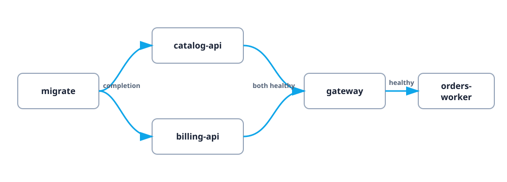

# Full dependency graph

This example looks more like an application: setup fans out to two APIs, both
fan in to a gateway, and a worker waits for the gateway.

## The graph



Every component is still safe and local. The APIs are tiny Python servers and
the migration script only prints progress.

## Run it

```bash
cd examples/full-stack
kranz -f kranz.yaml
```

Explicit `-f` avoids the adjacent `process-compose.yaml`, which is included for
format comparison.

## Guided scenario

1. Focus `orders-worker` and press `s`.
2. Kranz expands the dependency closure before starting anything, so queued
   intent is visible across the graph.
3. `migrate` completes once.
4. `catalog-api` and `billing-api` start in parallel.
5. `gateway` waits for both readiness probes.
6. `orders-worker` starts after gateway readiness and begins polling it.

Pin gateway logs with `Shift+3`, then focus the worker. You can now compare the
upstream request log and worker output at the same time.

## Important configuration patterns

The gateway has two health-gated dependencies:

```yaml
gateway:
  depends_on: [catalog-api, billing-api]
  dependency_conditions:
    catalog-api: {condition: process_healthy}
    billing-api: {condition: process_healthy}
```

The worker has an explicit failure policy:

```yaml
availability:
  restart: on_failure
  backoff: 2s
  max_restarts: 3
```

Recovery applies to process exits. It does not automatically restart detached
external resources whose status changes outside Kranz.

## Experiments

- Stop one API and observe reverse dependency shutdown.
- Start only `gateway`; the two APIs and setup are included, but the worker is
  not because it is a dependent, not a dependency.
- Compare `kranz.yaml` with `process-compose.yaml` in the same directory.
- Filter logs with `/`, then use `n` and `N` to move between matches.

## Ports and cleanup

| Service | Port |
| --- | --- |
| catalog-api | `18881` |
| billing-api | `18882` |
| gateway | `18883` |

Press `a`, then `s`, and confirm. All three listeners and the worker process are
owned and released by Kranz.
