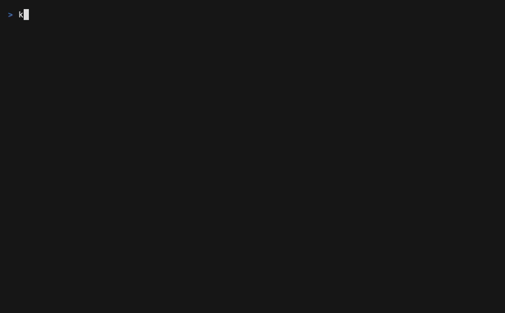
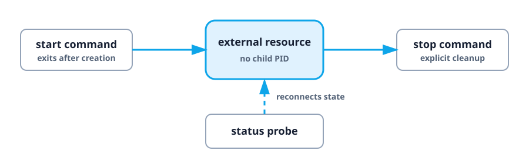

# Detached lifecycle playground

Use detached supervision when a start command finishes but the resource keeps
running elsewhere: Docker Compose with `up -d`, a VM, or a stack operated over
SSH. This playground teaches that model without Docker or a remote host.

<div class="demo-frame">



</div>

## What "detached" changes

A normal service is tied to a child PID. A detached service instead has
explicit capabilities:



The example simulates the external resource with ignored files under
`.kranz-demo/`. Nothing leaves the example directory.

## Run it

```bash
cd examples/lifecycle
kranz
```

| Service | What it teaches |
| --- | --- |
| `ticker` | An ordinary process using `command` shorthand |
| `guarded-worker` | An explicit start that asks for confirmation |
| `remote-stack` | A fully managed detached resource |
| `dependent-app` | Waiting on detached *readiness*, not existence |
| `observed-resource` | A resource Kranz can watch but not operate |

The five walkthroughs below are independent. Each one takes about a minute, and
each answers one question that detached supervision raises.

## 1. Why does one start ask and the other does not?

Start `ticker`: it starts immediately. Start `guarded-worker`: a confirmation
dialog appears first.

```yaml
guarded-worker:
  lifecycle:
    start:
      command: while true; do echo "guarded worker tick"; sleep 3; done
      confirm: true
```

`confirm` controls **start** only. Every stop asks regardless, because stopping
is the operation you cannot undo by waiting.

## 2. What does a running service with no process look like?

Start `remote-stack`. Its start command creates a marker file and exits, yet
the service is shown as running with `PID 0`.

That is the whole point of detached supervision: the thing that is running is
not a process Kranz owns. Open Details and read the `LIFECYCLE` row — it lists
`start, stop, status, logs`, the four capabilities this resource declares.

Notice the logs pane keeps producing output. That comes from
`lifecycle.logs`, a command that streams while the resource lives. Without it,
a detached service simply has no logs to show.

## 3. Existence and health are different questions

Try to start `dependent-app`. It stays queued, even though `remote-stack` is
already running.

```yaml
dependent-app:
  depends_on: [remote-stack]
  dependency_conditions:
    remote-stack:
      condition: process_healthy
```

`remote-stack` **exists** — its status probe says so. It is not yet **ready** —
its readiness command still fails. Expand `remote-stack`, run `mark-ready`, and
`dependent-app` starts.

Now run `mark-unready`. The stack stays running and turns unhealthy: lifecycle
status and health moved independently, which is exactly what you want when a
database container is up but still replaying its log.

## 4. What happens when Kranz cannot tell?

Run `status-unknown`. The probe now returns exit code `4`, which this example
declares as neither running nor stopped. After two consecutive unclassified
probes, the state becomes `Unknown`.

```yaml
status:
  command: if test -f .kranz-demo/stack.unknown; then exit 4; elif test -f .kranz-demo/stack.running; then exit 0; else exit 3; fi
  failure_threshold: 2
  running_exit_codes: [0]
  stopped_exit_codes: [3]
```

`Unknown` is a deliberate "no evidence" state, not a failure. Kranz does not
restart the resource, does not claim it stopped, and polls it on the slower
`stopped_interval` until it can tell again. Run `status-recover` to return.

This three-way contract is opt-in. Without `stopped_exit_codes`, exit `0` means
running and any other code means stopped — which is all most probes need.

## 5. A resource operated by something else

`observed-resource` declares only a status probe, so `s` does nothing: Kranz
never offers a control it cannot honestly perform.

Its `external-start` and `external-stop` actions imitate another tool changing
the resource behind Kranz's back. Run them and watch the state follow. This is
what reconnecting to an already-running Docker stack looks like at the start of
a new session.

## Stopping, and what survives

Stop `remote-stack` and confirm. Its explicit stop command removes the markers.

Now consider quitting instead. With `stop_on_exit: false` — the default for
detached resources — quitting Kranz leaves the resource running, and the quit
dialog says so explicitly, separating what will stop from what will be left
alone. The status probe reconnects it on your next launch.

## The lifecycle contract

```yaml
supervision: detached
stop_on_exit: false
lifecycle:
  start:
    command: ./start-resource
  stop:
    command: ./stop-resource
  status:
    type: command
    command: ./resource-status
```

Every part is optional except that a detached service must declare at least one
of them. Declare only what the resource actually supports; see the
[lifecycle guide](../guide/lifecycle) and the
[configuration reference](../reference/configuration#lifecycle).

## Cleanup

Expand the `playground` action group and run its confirmed `reset` action. It
only removes `.kranz-demo` marker files.

Full source: [`examples/lifecycle/kranz.yaml`](https://github.com/kranz-org/kranz/blob/main/examples/lifecycle/kranz.yaml).
