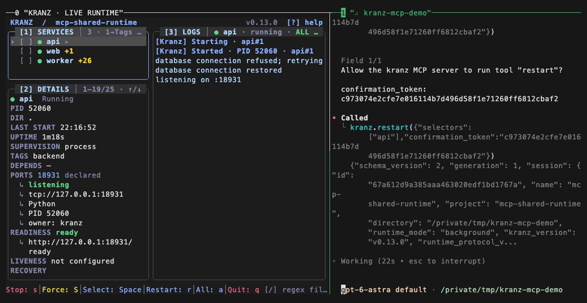

# MCP shared-runtime example

This local-only example proves that the CLI and an MCP client operate the same
Kranz runtime. It starts three harmless Python/shell services on localhost,
runs one action, reads its numbered result again, and cleans up the session.

<div class="demo-frame">



</div>

## Run it

The example uses the `kranz` installed in your `PATH`. From the repository
root, enter its directory:

```bash
cd examples/mcp-shared-runtime
```

Then use separate terminals if you want to keep the TUI visible:

```bash
kranz up -d
kranz attach                            # terminal 1: TUI
kranz status                            # terminal 2: CLI
python3 mcp_client.py status            # terminal 3: MCP
python3 mcp_client.py migrate
kranz down
```

The views report one runtime identity. The action result and logs use the same
`OWNER/ACTION#run`; the client's second result read does not execute the action
again. Closing either client leaves the independently owned runtime and its
services running.

The client starts one unbound `kranz mcp` process. Point a call at another live
runtime by passing its name from `runtimes`:

```bash
KRANZ_PROJECT_DIR=/workspace \
KRANZ_RUNTIME=another-runtime \
python3 mcp_client.py actions
```

## Ports and cleanup

The example listens only on `127.0.0.1:18931` and `127.0.0.1:18932`. Run
`kranz down` from the example directory when finished. If startup
reports a port conflict, inspect the owner instead of changing the example's
ports silently:

```bash
kranz port inspect 18931
kranz port inspect 18932
```

## Regenerate the recording

The recording is built from the same live client and project, with no fixture
JSON or personal environment data:

```bash
make build VERSION=v0.12.1
vhs docs/assets/tapes/mcp-shared-runtime.tape
```

The smoke evidence is recorded in
[`docs/assets/demo/mcp-smoke.md`](https://github.com/kranz-org/kranz/blob/main/docs/assets/demo/mcp-smoke.md),
and the runnable source lives in
[`examples/mcp-shared-runtime`](https://github.com/kranz-org/kranz/tree/main/examples/mcp-shared-runtime).
