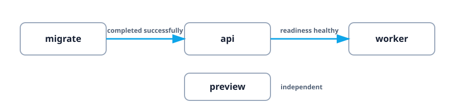

# Native YAML: your first service graph

This example is the smallest useful introduction to `kranz.yaml`. It combines a
one-shot setup command, readiness, dependency ordering, and runtime port
discovery without requiring a framework or database.

## The graph



`migrate` only prints messages and exits. `api` and `preview` are localhost
Python HTTP servers. `worker` is a harmless logging loop.

## Run it

```bash
cd examples/native
kranz
```

Press `a`, then `s`. Watch the states instead of only the logs:

1. `migrate` starts, prints two lines, and completes.
2. `api` starts only after the successful completion.
3. Its readiness probe requests `http://127.0.0.1:18201/`.
4. `worker` leaves `Queued` only after that request succeeds.
5. `preview` starts independently and Details discovers port `18202`.

## Read the important configuration

```yaml
services:
  migrate:
    command: echo "checking schema"; sleep 1; echo "schema is ready"

  api:
    command: python3 -u -m http.server 18201 --bind 127.0.0.1
    ports: [18201]
    depends_on: [migrate]
    dependency_conditions:
      migrate:
        condition: process_completed_successfully
    healthcheck:
      readiness:
        type: http
        url: http://127.0.0.1:18201/

  worker:
    command: while true; do echo "processed job"; sleep 3; done
    depends_on: [api]
    dependency_conditions:
      api:
        condition: process_healthy
```

The distinction is intentional: `migrate` must **finish successfully**, while
`api` must remain running and become **ready**.

## Experiments

- Start only `worker`. Kranz includes `api` and `migrate` automatically.
- Stop `api`. Kranz includes the dependent `worker` before stopping the API.
- Use `Shift+S` to operate only on the focused target and compare the result.
- Change the API readiness URL to a missing path and observe the worker remain
  queued.

## Cleanup

Press `a`, then `s`, and confirm. All listeners are local and all processes are
owned by Kranz.

Full source: [`examples/native/kranz.yaml`](https://github.com/kranz-org/kranz/blob/main/examples/native/kranz.yaml).
