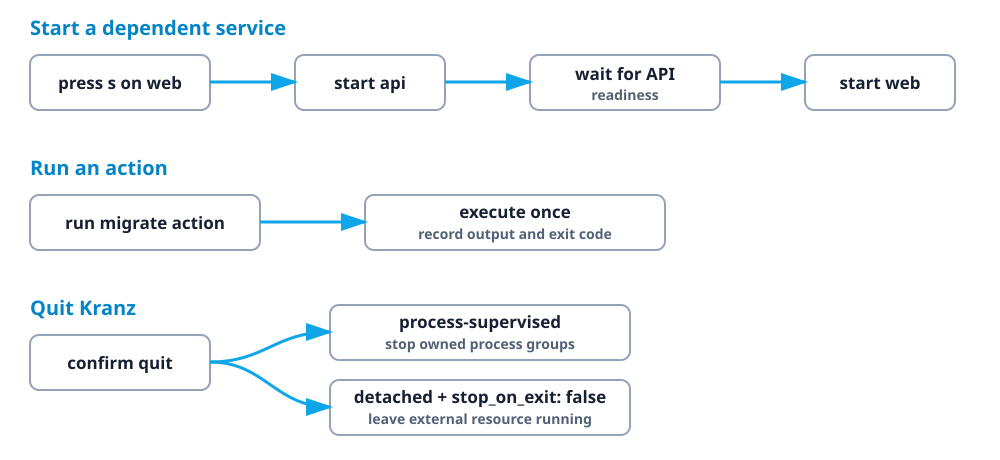

# Core concepts

Kranz becomes much easier to configure once five ideas are separate.

## Service

A service is something with a lifecycle: start it, observe it, and eventually
stop it. APIs, web dev servers, workers, and local databases are services.

```yaml
services:
  api:
    command: npm run dev
```

For a normal service, Kranz owns the process group, captures its output, and
knows it stopped when the process exits.

## Dependency

A dependency answers two questions:

1. What must start first?
2. What evidence means it is ready for the dependent?

```yaml
services:
  web:
    command: npm run dev
    depends_on: [api]
    dependency_conditions:
      api:
        condition: process_healthy
```

Starting `web` also starts `api`. `web` waits until the API readiness check
passes. Stopping `api` first stops `web`, because dependents are stopped in
reverse order.

## Health check

A running process is not necessarily a usable service. Readiness answers “may
dependents start?” Liveness answers “is this running service still healthy?”

```yaml
healthcheck:
  readiness:
    type: http
    url: http://127.0.0.1:3000/ready
    interval: 2s
```

Health does not start or stop anything by itself. It supplies evidence to the
UI and dependency graph.

## Action

An action is a command that should finish. Lint, test, build, migrate, seed, and
`docker compose ps -a` are actions—not services.

```yaml
services:
  api:
    command: npm run dev
    actions:
      lint:
        command: npm run lint
      migrate:
        command: npm run migrate
        confirm: true
```

Actions have their own output, exit status, timeout, and optional confirmation.
They do not pretend to be continuously running.

## Detached service

Sometimes the start command exits while the thing it started remains alive:

```bash
docker compose up -d
ssh host 'start-remote-stack'
```

There is no child PID for Kranz to supervise. A detached lifecycle provides the
missing operations explicitly:

```yaml
supervision: detached
stop_on_exit: false
lifecycle:
  start:
    command: docker compose up -d
  stop:
    command: docker compose down
  status:
    type: command
    command: ./is-stack-running.sh
    running_exit_codes: [0]
    stopped_exit_codes: [3]
```

Here `status` means “does the external resource exist and run?” It is not a
readiness check. With `stop_on_exit: false`, the resource survives Kranz; the
status probe reconnects it as `Running` in the next session.

## How the pieces fit



Next: learn the [configuration format](./configuration) or choose a
[runnable example](../examples).
