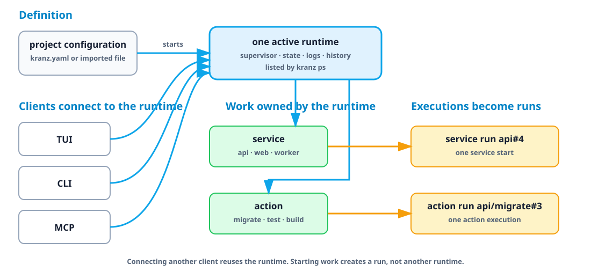

# Core concepts

Kranz becomes much easier to configure once seven ideas are separate.

## Runtime

A runtime is one active Kranz session for one project. It owns that project's
supervisor, service state, logs, and numbered run history. The TUI, CLI, and MCP
are clients of the same runtime; connecting another client does not start a
second copy of the services.

These names describe different levels:

| Term | Meaning | Example |
| --- | --- | --- |
| Project | The configuration and its display name | `project: Shop` |
| Runtime | One active session of that project | `shop-dev` in `kranz ps` |
| Service | One long-running or detached component inside the runtime | `api` |
| Run | One numbered execution of a service or action | `api#4` |



Running bare `kranz` ensures an independent runtime exists and opens its TUI.
The quit confirmation can either stop that runtime or detach the TUI and leave
everything running. `kranz up -d` starts without opening a long-lived client;
`kranz attach` opens another TUI client, and `kranz down` ends the runtime. Use
`kranz ps` when you are unsure which runtimes already exist.

## Service

A service is something with a lifecycle: start it, observe it, and eventually
stop it. APIs, web dev servers, workers, and local databases are services.

```yaml
services:
  api:
    command: npm run dev
```

For a normal service, Kranz owns the process group, captures its output, and
knows it stopped when the process exits.

## Dependency

A dependency answers two questions:

1. What must start first?
2. What evidence means it is ready for the dependent?

```yaml
services:
  web:
    command: npm run dev
    depends_on: [api]
    dependency_conditions:
      api:
        condition: process_healthy
```

Starting `web` also starts `api`. `web` waits until the API readiness check
passes. Stopping `api` first stops `web`, because dependents are stopped in
reverse order.

## Health check

A running process is not necessarily a usable service. Readiness answers “may
dependents start?” Liveness answers “is this running service still healthy?”

```yaml
healthcheck:
  readiness:
    type: http
    url: http://127.0.0.1:3000/ready
    interval: 2s
```

Health does not start or stop anything by itself. It supplies evidence to the
UI and dependency graph.

## Action

An action is a command that should finish. Lint, test, build, migrate, seed, and
`docker compose ps -a` are actions—not services.

```yaml
services:
  api:
    command: npm run dev
    actions:
      lint:
        command: npm run lint
      migrate:
        command: npm run migrate
        confirm: true
```

Actions have their own output, exit status, timeout, and optional confirmation.
They do not pretend to be continuously running.

## Run and log history

A *run* is one execution of a service or action. Starting `api` creates a
service run such as `api#4`; invoking its migration creates a separate action
run such as `api/migrate#3`. Numbers increase independently for each target and
are never reused during the runtime session.

The run summary answers **what happened**: who started it, why, how long it ran,
and how it ended. The retained log events answer **what it printed**, with each
line attributed to `stdout`, `stderr`, or Kranz itself. Summary and output have
separate bounded retention, so an old summary may remain after some or all of
its output has expired; Kranz reports that state explicitly as `complete`,
`partial`, or `unavailable`.

See [Logs, runs, and ports](./logs-and-ports) for the visual model, CLI queries,
and TUI navigation.

## Detached service

Sometimes the start command exits while the thing it started remains alive:

```bash
docker compose up -d
ssh host 'start-remote-stack'
```

There is no child PID for Kranz to supervise. A detached lifecycle provides the
missing operations explicitly:

```yaml
supervision: detached
stop_on_exit: false
lifecycle:
  start:
    command: docker compose up -d
  stop:
    command: docker compose down
  status:
    type: command
    command: ./is-stack-running.sh
    running_exit_codes: [0]
    stopped_exit_codes: [3]
```

Here `status` means “does the external resource exist and run?” It is not a
readiness check. With `stop_on_exit: false`, the resource survives Kranz; the
status probe reconnects it as `Running` in the next session.

## How the pieces fit


Next: learn the [configuration format](./configuration) or choose a
[runnable example](../examples).
