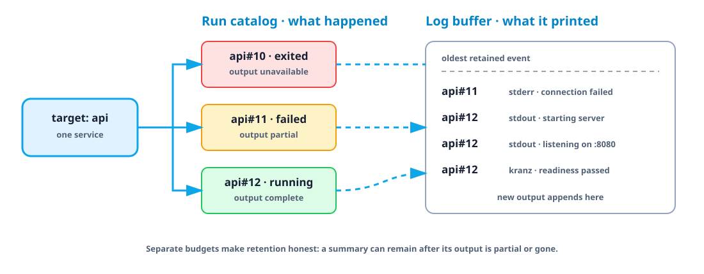

# Logs, runs, and ports

Kranz keeps output attributable even after a service restarts or an action
finishes. The useful mental model has three levels:

| Level | What it identifies | Examples |
| --- | --- | --- |
| Target | The service or action whose work you asked about | `api`, `api/migrate` |
| Run | One numbered execution of that target | `api#4`, `api/migrate#3` |
| Log event | One captured line from that run and source | `stdout`, `stderr`, `kranz` |

Service and action numbers are independent. `api#4` and `api/migrate#4` are not
the same run; the complete target before `#` is part of the identity.



## Logs

<div class="demo-frame">


</div>

Kranz captures stdout and stderr for process services and actions. Detached
services can provide `lifecycle.logs.command`, usually a following command such
as `docker compose logs -f`. Its process is managed independently from the
short-lived lifecycle start and stop commands.

Without run options, `kranz logs api` shows a recent tail because a service may
stream forever. `kranz logs api/migrate` shows the latest action run in full
because an action is a finite report. Use `--run`, `--runs`, `--tail`, or
`--all` when you want a different boundary.

The log panels support:

- regex filter and highlight modes;
- next and previous match navigation;
- wrapping and captured-at timestamps;
- pause/follow mode and unread counters;
- a pinned service above the currently focused log panel.

## Run history

Every start of a service and every invocation of an action is a numbered *run*.
Run numbers are assigned once and never reused, so `api#4` keeps addressing the
same execution after later runs age out of the buffer.

Kranz retains a bounded catalog of run summaries per target, independently of
the log buffer. A noisy service can only evict its own history, never another
target's. Think of the catalog as the index of executions and the log buffer as
the retained evidence for what those executions printed.

```bash
kranz runs                          # every retained run, with retention budgets
kranz runs api analytics/stats      # narrow to one or more targets
kranz logs api --run 4              # only run #4
kranz logs api --run -1             # the newest run
kranz logs api --runs 3             # the last three runs
```

A run summary records how the run ended and who started it: exit code,
duration, the structured cause of a state, the surface that initiated it
(`tui`, `cli`, `mcp`, or `runtime`), and why (`first_start`, `manual_start`,
`invoked`, and so on). Client labels are short product names, never socket,
process, or user identifiers.

Addressing a run that is not retained is an error rather than empty output, and
the message names the range each selected stream can still answer for:

```console
$ kranz logs api --run 99
Kranz: run #99 is not retained by anything this query selected.
Retained runs: api #7-#12.
```

The catalog and the log buffer have separate budgets, so a run's summary can
outlive its output:

- `complete` — all retained output for the run is available;
- `partial` — the beginning was evicted, and Kranz reports the missing line and
  byte counts before the available tail;
- `unavailable` — the summary remains, but none of that run's output does.

Kranz never presents a shortened log as if it were complete.

In the TUI, `v` opens the run history for the focused service or action. `x`
switches between all runs and a single run, `[` and `]` step through history,
`Shift+F` jumps to the previous failed run, and `l` returns to the latest.
`Shift+3` pins a run so it stays frozen while the live panel keeps moving.
See [Controls](../reference/controls) for the complete list.

Retention is per session. A run summary and its output can also be dropped
explicitly:

```bash
kranz runs delete api#4 --confirm
```

Deleting a run never reuses its number and never touches the transition
journal, so history stays honest about what happened.

## Declared ports

```yaml
services:
  web:
    command: npm run dev
    ports: [3000]
```

Declared ports are checked before start. When a listener is already occupied,
Kranz identifies whether it belongs to another managed service or an external
process. An external process is only signalled after an explicit action and a
fresh ownership check.

## Runtime discovery

Without `ports`, discovery defaults on. Kranz scans listeners owned by the
service process group, including child processes. With declared ports,
discovery defaults off unless `detect_ports: true` is set.

```yaml
services:
  web:
    command: npm run dev
    detect_ports: true
    ports: [3000]
```

Details distinguishes `declared`, `detected`, and `declared · listening`.
Discovery uses `lsof` on macOS and `ss` on Linux.

## Dynamic health targets

A TCP check without a static port can use a detected listener. An HTTP URL
without an explicit port can do the same:

```yaml
healthcheck:
  readiness:
    type: http
    url: http://127.0.0.1/ready
    detected_port_index: 0
```

When multiple listeners exist, set `detected_port_index` explicitly. The index
addresses the sorted, deduplicated runtime port list.
