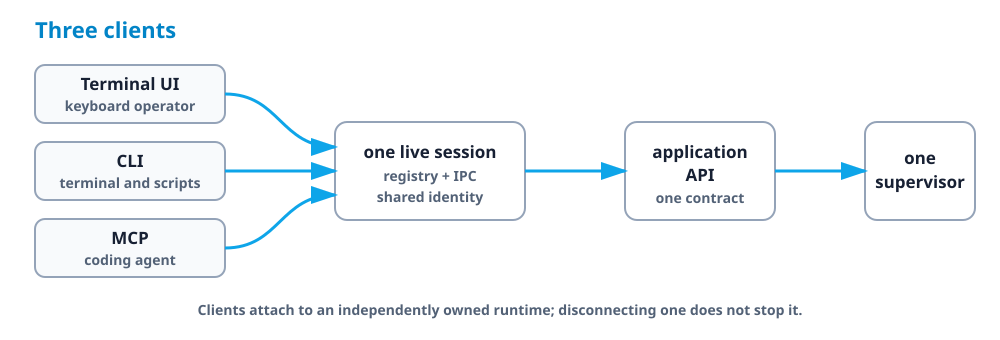

# Coding agents and your live runtimes

Kranz MCP lets a coding agent join the local runtimes already open in your TUI.
The agent sees the same services, actions, readiness, ports, action-run numbers,
and bounded logs. It does not start a second development stack.

One registration covers every project. `kranz mcp` takes no project argument,
creates nothing when a client connects, and picks the runtime per call — so
"read the logs of the service I am looking at" works in the project you are in,
and in the one next door.

TUI, CLI, and MCP are three views of the same application API:



The TUI is the interactive operator view, the CLI is the terminal and scripting
view, and MCP is the coding-agent view. None of them shells out to another.

<div class="demo-frame">


</div>

The recording is a real Codex session, not a scripted imitation. The Kranz TUI
on the left and the coding agent on the right are attached to one runtime. Codex
asks Kranz to resolve the restart, confirms the exact affected set, performs the
operation, and waits for readiness through MCP. The recording runs from an
isolated temporary project; setup and cleanup are hidden, and no account,
credential, home-directory path, real project, or terminal history is shown.
Its recording driver accepts only the `plan`, `restart`, and `wait` prompts for
that temporary Codex session and does not persist approval rules.

## Install and verify Kranz

The MCP bridge is part of the ordinary `kranz` binary; there is no separate
server package to install. Follow the [installation guide](./installation),
then verify that your build includes the command:

```bash
kranz version
kranz mcp --help
```

The bridge uses foreground stdio. Register it once, with no arguments, and let
the client start and supervise the command. It starts even in a directory with
no Kranz configuration, and it never creates a runtime just because a client
connected.

## Register the server

### Codex

```bash
codex mcp add kranz -- kranz mcp
codex mcp list
```

Codex also supports a project-scoped `.codex/config.toml`:

```toml
[mcp_servers.kranz]
command = "kranz"
args = ["mcp"]
```

The Codex CLI, IDE extension, and ChatGPT desktop app on the same host share
this configuration. In an interactive Codex session, use `/mcp` to inspect the
connected server. See the [official Codex MCP setup](https://learn.chatgpt.com/docs/extend/mcp)
for client-side configuration and approval options.

### Claude Code

One user-scoped registration covers every project:

```bash
claude mcp add --scope user kranz -- kranz mcp
claude mcp get kranz
```

### OpenCode

```json
{
  "$schema": "https://opencode.ai/config.json",
  "mcp": {
    "kranz": {
      "type": "local",
      "command": ["kranz", "mcp"],
      "enabled": true
    }
  }
}
```

Check it with `opencode mcp list`. Use absolute paths when the client does not
inherit the same `PATH` as your shell.

## Install the companion agent skill

The MCP connection exposes Kranz operations, but a connection alone does not
teach an agent when to reuse a developer's runtime, how to match a nested
working directory, or which mutations require an explicit request. Kranz ships
that operational policy as an English, vendor-neutral agent skill in
[`skills/kranz-services`](https://github.com/kranz-org/kranz/tree/main/skills/kranz-services).

In Codex, ask the built-in installer:

```text
$skill-installer install kranz-services from https://github.com/kranz-org/kranz/tree/main/skills/kranz-services
```

From an existing clone, a manual user-level installation is also just a copy:

```bash
mkdir -p ~/.agents/skills
cp -R skills/kranz-services ~/.agents/skills/
```

Codex discovers the skill automatically; restart it if the new skill does not
appear. Other clients that implement the open Agent Skills format can install
the same directory in their supported skill location.

## Check the first connection

Open the configured client in that project and ask:

> Which Kranz services are running, and which are not ready?

The client should discover Kranz resources and tools without you naming
protocol calls. The MCP process itself never appears in `kranz ps` — it
supervises nothing — but `kranz clients` shows it attached to whichever runtime
it just answered from. Closing the client leaves the TUI and services running.

## How a call finds its runtime

Every tool except `runtimes`, `up`, and `down` takes an optional `runtime`
argument. The address is resolved in this order, first match wins:

1. the `runtime` argument, naming a project by name or id;
2. the `-C`/`-p` pin, if the server was registered with one;
3. the directory the client started the server in, looked up in the registry
   the same way `kranz logs` looks it up without `-p`;
4. otherwise `runtime_required`, listing every running runtime as a candidate.

Nothing in that chain creates a runtime. Step 3 is a lookup, which is why the
directory is safe to use here: an agent registered in one project reaches that
project by default, and reaches any other by naming it.

The working directory is fixed when the client spawns the server, so it does
not follow you as the conversation moves to another project. That lands on
`runtime_required`, and its candidates can be passed straight back:

```json
{"code": "runtime_required",
 "message": "no runtime was addressed and this MCP server has no project of its own",
 "details": {"candidates": [
   {"runtime": "myclass", "id": "98784c10", "directory": "/Users/you/Dev/MyClass"},
   {"runtime": "harness", "id": "10a2a490", "directory": "/Users/you/Dev/Harness"}]}}
```

The same holds one level down: if `im-core` is missing here but exists in
`myclass`, `selector_not_found` carries `available_in`, and repeating the call
with that `runtime` succeeds.

## Server, project, and runtime names

The same setup exposes three related names, each with a different job:

- `kranz` in `mcp_servers.kranz`, `mcp add kranz`, or the OpenCode key is the
  MCP client's local alias for this connection;
- `project: "Harness"` is the display title from `kranz.yaml`;
- `harness` in `kranz ps` is the runtime name. It comes from `runtime.name`
  when that field is set, otherwise from a stable lower-case slug of `project`.

Runtimes and the clients attached to them are listed separately: `kranz ps`
answers "what is running", `kranz clients` answers "who is working in it". An
MCP server is a client, never a row in `ps`.

## Pinning a connection to one project

`-C DIR`, `-f FILE`, and `-p NAME|ID` pin the server to one project. A pinned
connection resolves everything to that runtime and refuses any other address
with `runtime_pinned` — useful when a client should be unable to reach beyond
one checkout. Existing registrations that pass these flags keep working
unchanged; they are now a choice rather than a requirement.

`--attach-only` is accepted and ignored. It disabled an owner fallback that no
longer exists.

## Starting a project the agent was asked to start

An agent can bring up a project that is not running, and only when asked:

- `up` starts the runtime and **no services**. It requires `confirm: true`,
  because the runtime it creates is a background process that outlives the
  session and stays in `kranz ps` until someone stops it.
- Every other tool answers `runtime_not_found` for a project that is not
  running, and names `up` in the hint. Asking for logs never starts anything.
- `down` reaches only a runtime this MCP session started with `up`. A project
  you are working in answers `not_owned`.

Starting services stays a separate, deliberate `start` call against a resolved
plan.

Try prompts that describe an outcome rather than protocol calls:

- Which services are not ready, and why?
- Show the latest failed `api/migrate` run.
- Restart `api` and wait until it is ready; do not stop the rest of the stack.
- What changed in the environment since I edited the handler?
- I added a service to kranz.yaml — reload and start it.

## Several agents, several runtimes

One MCP process serves any number of runtimes at once, and any number of agents
can attach to one runtime — that is what `kranz attach` has always allowed. Each
answer names the runtime that produced it in `session`, so a result can never be
misread as coming from the project you happened to be thinking about.

Closing an MCP client closes its connections and nothing else. The runtimes it
was talking to keep running, including one it started itself with `up`: that
runtime is owned by its own background process, exactly like `kranz up -d`.

The path is the same as the CLI:

```text
MCP tools → registry → IPC client → application API → supervisor
```

## Actions and exact runs

Actions keep monotonic run numbers. `action_result` accepts an absolute run or
a negative offset such as `-1`; `logs` uses the same identity. Interactive
actions return `interactive_action` and must be run in the TUI or terminal CLI.

Services are numbered the same way: every start opens a run, so `logs` with
`run: -1` on a service reads the newest start on its own, without the agent
reconstructing a time range around a restart.

## What changed since I last looked

The question a coding agent asks after editing code is not "what is the state"
but "what did my change do to the environment". `status` cannot answer it: a
service that crashed and was restarted looks exactly like one that never
moved. `changes` answers it directly.

```text
1. changes {}                    → cursor 41
2. edit code, or run an action
3. changes {"since": 41}         → api restarted · api ports 8080 -> 8081
                                   · api/migrate #3 failed · exit 1
```

Anything that carries a cursor hands one back, so the loop closes: `wait`
returns the cursor it finished at, and passing the cursor you held *before* the
wait to `changes` replays what happened during it. When the bounded journal has
already dropped part of the answer, the result says `truncated: true` rather
than quietly returning a shorter story.

## Why a service is not running

A stopped service is not a reason. `status` carries a structured `cause` when
the reason is not the state itself:

```json
{ "name": "api", "state": {"status": "stopped", "cause": {
    "type": "prerequisite_failed", "action": "api/migrate", "action_run": 3 }}}
```

`dependency_failed` names the dependency and its exit code, `port_conflict`
names the port and the process holding it, and `exited` carries the exit code.
For probes, `health` reports the target that was contacted and the error it
returned, so a readiness failure reads as `connection_refused` at a named URL
rather than as a boolean. `port_inspect` answers "who took my port" for any
port, including processes Kranz does not manage.

## Reproduce the shared-runtime proof

The [MCP shared-runtime example](../examples/mcp-shared-runtime) performs live
stdio calls and includes the exact commands behind the recording. It does not
print fixture results. The CLI and MCP client report one session identity, and
reading an action result twice does not execute it again.

For protocol schemas, resources, tools, cursors, confirmation, and error codes,
see the [MCP reference](../reference/mcp).
